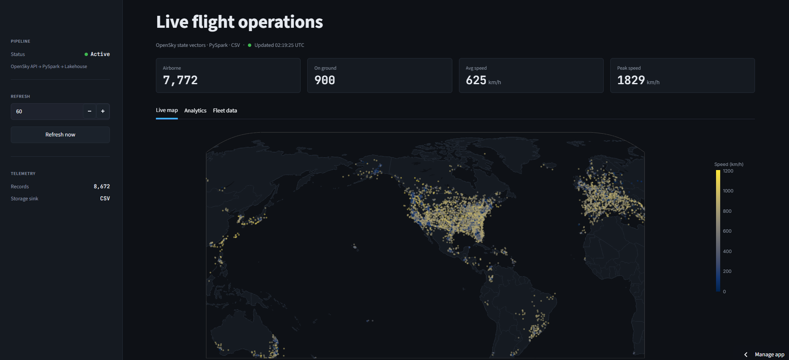
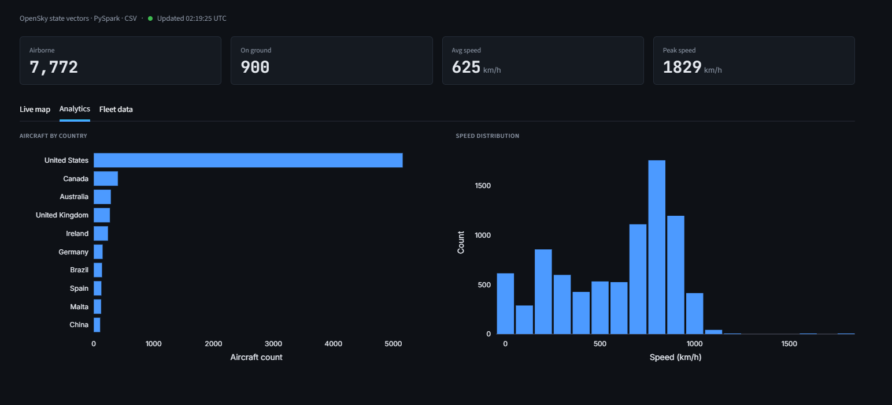
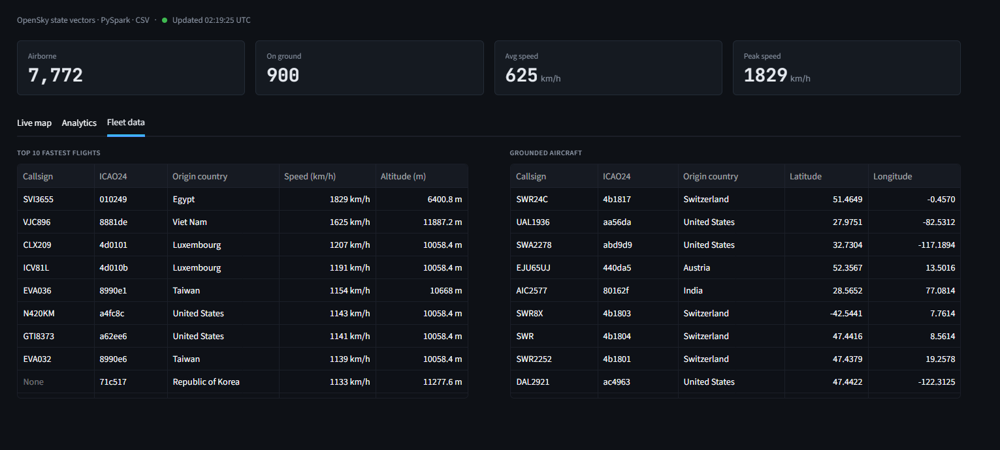

# Live Flight Data Pipeline

A production-grade, local flight data engineering pipeline that ingests live aircraft state vector data from the OpenSky Network REST API, applies PySpark data quality transformations, persists date-partitioned Lakehouse datasets, and exposes an interactive Streamlit visualization serving layer.

**Live Demo**: [https://flight-data-pipeline-jcpcyaz4r2nbjtg7euz2sz.streamlit.app/](https://flight-data-pipeline-jcpcyaz4r2nbjtg7euz2sz.streamlit.app/)

---

## Screenshots

### Live map — global aircraft positions, colour-encoded by speed


### Analytics — aircraft by country and speed distribution


### Fleet data — fastest flights and grounded aircraft tables


---

## 🏗 Architecture & Data Flow

```text
┌───────────────────────────┐
│   OpenSky Network API     │ (Live REST API State Vectors)
└─────────────┬─────────────┘
              │
              ▼
┌───────────────────────────┐
│  Ingestion Layer (PySpark)│ -> Explicit StructType Schema, Network Failover & Error Handling
└─────────────┬─────────────┘
              │
              ▼
┌───────────────────────────┐
│ Transformation & Quality  │ -> Pure Functions: Null Removal, Range Filtering & Type Casting
└─────────────┬─────────────┘
              │
              ▼
┌───────────────────────────┐
│ Partitioned Storage Sink  │ -> Hive-partitioned Storage Sink (`ingest_date=YYYY-MM-DD/`)
└─────────────┬─────────────┘
              │
              ▼
┌───────────────────────────┐
│ Streamlit Serving Layer   │ -> Realtime KPI Cards, Geospatial Map & Analytical Views
└───────────────────────────┘
```

1. **Source**: Fetches raw aircraft state vector responses from OpenSky API (`https://opensky-network.org/api/states/all`).
2. **Ingestion Layer (`ingest_flights.py`)**: Enforces an explicit PySpark `StructType` schema without relying on expensive runtime inference. Provides network timeout resilience and graceful empty payload handling.
3. **Data Quality Layer (`clean_data.py`)**: Executes pure, composable PySpark transformations to handle missing values, cast types, and validate coordinate/altitude/speed physical boundaries.
4. **Partitioned Storage Sink (`run_pipeline.py`)**: Writes output datasets partitioned by `ingest_date` in Parquet layout (with automated CSV fallback).
5. **Serving Layer (`dashboard.py`)**: Interactive Streamlit application displaying global flight statistics, speed leaderboards, ground status, and live interactive world map positioning.

---

## 📋 OpenSky Schema Definition

The pipeline enforces an explicit PySpark `StructType` schema for incoming flight state vector payloads:

| Field Name | PySpark Type | Nullable | Description |
| :--- | :--- | :--- | :--- |
| `icao24` | `StringType` | True | Unique ICAO 24-bit transponder address |
| `callsign` | `StringType` | True | Flight callsign |
| `origin_country` | `StringType` | True | Country of aircraft registration |
| `time_position` | `LongType` | True | Unix timestamp of position update |
| `last_contact` | `LongType` | True | Unix timestamp of last contact |
| `longitude` | `DoubleType` | True | WGS-84 longitude in degrees (-180 to 180) |
| `latitude` | `DoubleType` | True | WGS-84 latitude in degrees (-90 to 90) |
| `baro_altitude` | `DoubleType` | True | Barometric altitude in meters (-1000m to 30,000m) |
| `on_ground` | `BooleanType` | True | Flag indicating whether aircraft is on ground |
| `velocity` | `DoubleType` | True | Ground speed in meters per second (0 to 1,000 m/s) |

---

## ⚙️ Environmental Configurations

| Environment Variable | Default | Description |
| :--- | :--- | :--- |
| `PIPELINE_ENABLE_PARQUET` | `0` | Set to `1` to enable Parquet partitioned output; `0` uses CSV storage fallback. |
| `PYSPARK_PYTHON` | Active Interpreter | Python interpreter executable path utilized by PySpark worker processes. |
| `PYSPARK_DRIVER_PYTHON` | Active Interpreter | Python interpreter executable path utilized by PySpark driver. |

---

## 🚀 Installation & Setup

Install core requirements directly via `pip`:

```bash
pip install -r requirements.txt
```

Or using standard Conda virtual environments:

```bash
conda create -n flight-pipeline python=3.10
conda activate flight-pipeline
pip install -r requirements.txt
```

---

## 📁 Project Layout

- `.github/`                  — GitHub Actions CI configurations
  - `workflows/ci.yml`       — Automated linting (Flake8) and PyTest CI workflow
- `flight_pipeline/`          — Core data engineering pipeline and dashboard source
  - `.streamlit/`             — Streamlit layout and theme settings
    - `config.toml`           — Streamlit visual configuration parameters
  - `static/`                 — Dashboard custom typography font assets and licenses
  - `clean_data.py`           — Pure PySpark data quality cleaning and validation logic
  - `dashboard.py`            — Streamlit analytics dashboard and serving interface
  - `flights_stats.py`        — Analytical transformations and aggregation functions
  - `ingest_flights.py`       — API ingestion with explicit PySpark schema and error handling
  - `run_pipeline.py`         — Main runner orchestrating ETL and partitioned storage writes
  - `Logo2.png`               — Dashboard header logo asset
  - `summary_data_pipeline.pdf` — Architecture summary report document
- `docs/`                     — Documentation assets
  - `screenshots/`            — Dashboard screenshot gallery
    - `dashboard_live_map.png`   — Live map tab screenshot
    - `dashboard_analytics.png`  — Analytics tab screenshot
    - `dashboard_fleet_data.png` — Fleet data tab screenshot
- `output/`                   — Partitioned Lakehouse storage destination (Parquet / CSV)
  - `.gitkeep`                — Git directory preservation file
- `tests/`                    — Automated unit test suite
  - `conftest.py`             — PyTest PySpark session fixtures
  - `test_clean_data.py`      — Unit tests for data quality and pure transformation functions
  - `test_flights_stats.py`   — Unit tests for metrics aggregations
  - `test_ingest_flights.py`  — Unit tests for explicit schema and network failure handling
- `.gitignore`                — Version control ignore rules
- `README.md`                 — Production documentation & architecture specification
- `requirements.txt`          — Project Python package dependencies

---

## 🏃 Running the Pipeline & Dashboard

### Executing the Data Pipeline

Run the pipeline runner from the project root:

```bash
python flight_pipeline/run_pipeline.py
```

To enable Parquet partitioned lake output:

```bash
# Linux / macOS
export PIPELINE_ENABLE_PARQUET=1
python flight_pipeline/run_pipeline.py

# Windows PowerShell
$env:PIPELINE_ENABLE_PARQUET = '1'
python flight_pipeline/run_pipeline.py
```

### Launching the Dashboard

Start the Streamlit dashboard after output datasets are generated:

```bash
streamlit run flight_pipeline/dashboard.py
```

---

## 🧪 Testing & Quality Assurance

Run the automated PyTest test suite:

```bash
pytest tests/ -v
```

Automated continuous integration is pre-configured in `.github/workflows/ci.yml` to run code quality checks (Flake8) and execution of unit tests on every push or pull request.
